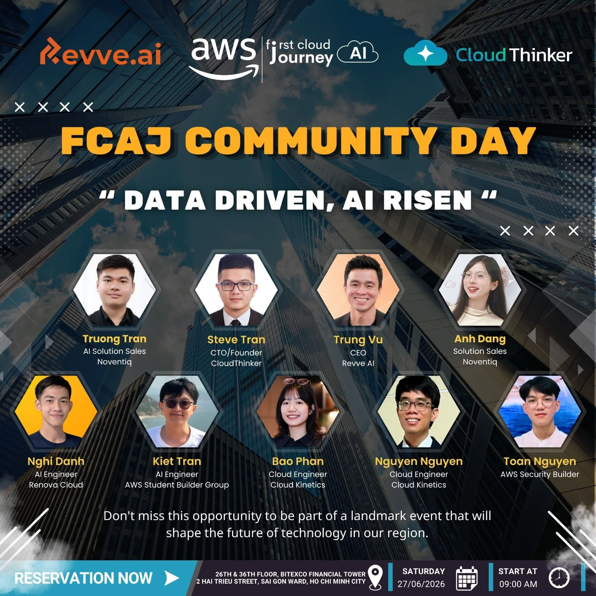
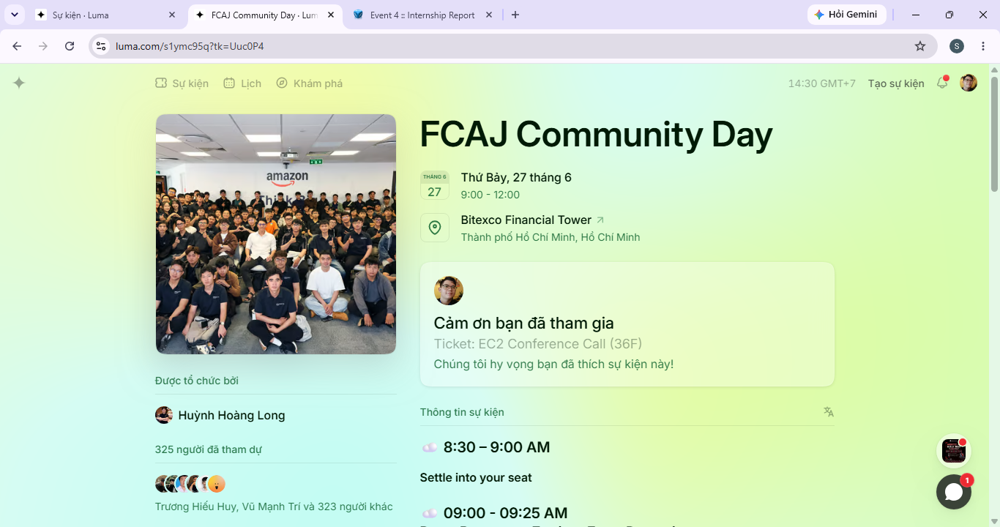

# Summary Report: “FCAJ Community Day June 2026 - Data driven, AI risen”

### Event Objectives

- Share best practices in modern application design
- Introduce Domain-Driven Design (DDD) and event-driven architecture
- Provide guidance on selecting the right compute services
- Present AI tools to support the development lifecycle

### Speakers

* **Truong Tran** – AI Solution Sales at Noventiq
* **Steve Tran** – CTO / Founder at CloudThinker
* **Trung Vu** – CEO at Revve AI
* **Anh Dang** – Solution Sales at Noventiq
* **Nghi Danh** – AI Engineer at Renova Cloud
* **Kiet Tran** – AI Engineer at AWS Student Builder Group
* **Bao Phan** – Cloud Engineer at CloudKinetics
* **Nguyen Nguyen** – Cloud Engineer at CloudKinetics
* **Toan Nguyen** – AWS Security Builder

### Key Highlights

#### Deep Response Engine: From Detection to Autonomous Resolution

- ​The complexity wall in modern cloud operations
- Shift from alert-driven to action-driven systems
- ​Deep Response Engine architecture overview
- ​Live demo of autonomous incident response
- ​Business impact: cost reduction and zero-downtime operations

#### Voice Agents: Building Human-Like AI Conversations at Scale

- ​Evolution from IVR and chatbots to AI voice agents
- ​Key challenges: latency, accuracy, and natural interaction
- ​Amazon Nova Sonic and speech-to-speech foundation model
- ​Architecture: telephony, streaming, Bedrock, MCP tools
- ​Enterprise use cases, best practices, and live demo

#### AWS DevOps Agent: Your Always-Available Operations Teammate

- ​Overview of AWS DevOps Agent
- ​Reducing MTTD and MTTR with AI-driven operations
- ​Supporting multi-cloud and hybrid environments
- ​Bedrock AgentCore and multi-agent reasoning approach
- ​Real-world use cases and ECS demo walkthrough

#### AI-Powered Productivity: Workforce Planning For Enterprise

- ​HR transformation challenges in modern enterprises
- ​Overview of Amazon Quick and its HR capabilities
- ​Accelerating HR operations with automation
- ​Workforce analytics and data-driven insights
- ​Strategic workforce planning for enterprise decision-making

#### Building Secure Private MCP Connection with Amazon Quick

- ​Introduction to Amazon Quick as an AI assistant platform
- ​MCP (Model Context Protocol) and its role in extensibility
- ​Security challenges in MCP-based integrations
- ​Configuring Amazon Quick VPC private connectivity
- ​Demo and real-world implementation insights

### Key Takeaways

- **The Impact of AI on Cloud Engineering**: Understanding the development trends of AI and automation tools in the industry, while recognizing the limitations of AI in its inability to completely replace human thinking and strategic decision-making in complex infrastructures.

- **Solving the Complexity Problem**: Grasping how new technology solutions help manage and reduce system complexity as businesses scale.

- **FinOps and Cloud Cost Optimization**: Understanding how to apply AI to analyze AWS resource billing, optimizing operational and financial costs in the cloud effectively.

- **Security and Vulnerability Testing**: Gaining knowledge about building security testing systems (penetration testing), controlling infrastructure coding, and managing secure credentials.

- **Estimating Real Infrastructure Costs**: Understand the cost components when deploying a large-scale system, including costs for network components (such as ALB, Round 53 Resolver) and security (AWS Secret Manager).

### Applying to Work

- **Applying AI to FinOps**: Utilizing tools and solutions to support analysis and optimize AWS infrastructure costs in real-world enterprise projects.

- **Enhancing Complex System Management Capabilities**: Applying methodologies to control large-scale cloud environments, optimize resources, and minimize manual operational burdens.

- **Strengthening Security Control**: Implementing more rigorous vulnerability assessment processes and infrastructure configuration control.

- **Improving Resource Planning Skills**: Building more accurate cost estimates for cloud infrastructure deployment projects based on real-world specifications.

### Event Experience

Participating in the **“Community Day June 2026”** workshop was a very rewarding experience, giving me a comprehensive view of how to modernize applications using modern AI methods and tools. Some highlights include:

#### Learning from highly qualified speakers
- Speakers from AWS and major technology organizations shared **best practices** in modern application design.

- Through real-world case studies, I gained a better understanding of the impact of AI and automation tools on **Cloud Engineering** and their limitations in relation to human thinking.

#### Practical engineering experience
- Learning solutions for solving complex system problems as businesses scale.

- Understanding how to apply AI to **FinOps** to analyze resource billing and optimize operating costs on the Cloud.

- Gain a thorough understanding of security testing (penetration testing) and secure credential management within the system.

#### Applying Modern Tools
- Directly learn about AI solutions and tools that support automation in cloud infrastructure and operations management.

- Learn how to apply AI to FinOps to analyze invoices, optimize AWS resource costs, and improve operational performance.

#### Networking and Exchange
- The event provided opportunities to network with the AWS technology community and engage in direct, highly interactive Q&A sessions with experts.

- Through practical sharing, I realized the importance of closely integrating technical infrastructure solutions with the operational goals of the business, rather than focusing solely on technology.

#### Lessons Learned
- AI is a powerful tool for optimizing costs (FinOps) and supporting operations, but it cannot completely replace the strategic decision-making role of humans.

- Managing cloud infrastructure requires a deep understanding of network architecture, security, and tight cost control.

- A proactive approach is needed to cope with the increasing complexity of the system as the business grows.

#### Some event photos

> Overall, the event not only provided technical knowledge but also helped me reshape my thinking about application design, system modernization, and cross-team collaboration.
