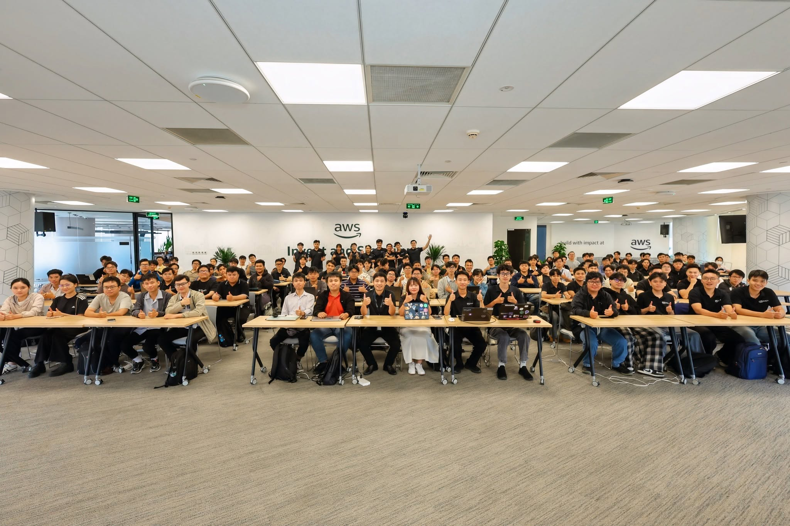

# Harvest Report: “Agent Forge - Deepdive”

### Purpose of the Event

The workshop was organized to help participants:

- Understand foundational concepts of **Agentic AI** and AI Agents.
- Learn how to build and deploy AI Agents for **production** environments using **Amazon Bedrock AgentCore**.
- Master the architecture, lifecycle, and components of an AI Agent system.
- Practice using tools, security workflows, and techniques necessary for developing AI Agents.
- Explore real-world applications of AI Agents in process automation and enterprise problem-solving.

### List of Speakers

- **Nghia Tran** - Agentic AI Solution Architect
- **Anh Pham** - Cloud Consultant G-AsiaPacific Vietnam

### Workshop Format

This is a **3-day workshop series**, designed with a roadmap ranging from fundamental knowledge to deploying AI Agents in production environments using Amazon Bedrock AgentCore.

- **Day 1 (08/01): AgentCore Foundations** Explore the overall architecture of Amazon Bedrock AgentCore, including **Runtime**, **Gateway**, and **Identity**, along with foundational concepts for building AI Agents.

- **Day 2 (08/08): Memory, Evaluations, Observability & Optimization** Discover how to manage **Memory**, evaluate AI Agent performance (**Evaluations**), monitor systems (**Observability**), and optimize performance (**Optimization**).

- **Day 3 (08/15): DevOps, Policies & Production Best Practices** Learn the **DevOps** workflow for AI Agents, build **Policies**, apply security measures, and follow **best practices** for deploying AI Agents in production environments.

## Key Content Highlights

### 1. Overview of Agentic AI

#### What is Agentic AI?

**Agentic AI** refers to artificial intelligence systems capable of **autonomously pursuing a goal** rather than merely responding to individual user prompts. Upon receiving a goal, Agentic AI can plan, select tools, execute the necessary steps, and evaluate results to accomplish the task.

Key characteristics of Agentic AI:

- **Planning**: Breaking down complex tasks into specific action steps.
- **Decision Making**: Choosing appropriate actions based on context and goals.
- **Tool Use**: Calling APIs, searching for information, accessing databases, or using external services.
- **Autonomous Execution**: Performing multiple consecutive steps with minimal human intervention.
- **Evaluation and Adjustment**: Checking results after each step and revising the plan when necessary.

**Example:** A user requests, *"Deploy the application to AWS."* Instead of just giving step-by-step instructions, Agentic AI can build the application itself, create a Docker image, push the image to a container registry, deploy it to a cloud service, check system status, and report the final outcome.

#### Autonomy Levels

The workshop classifies AI agents across an autonomy spectrum:

1. **Deterministic agents**: Operate under fixed rules.  
   *Example:* Automatically formatting source code or running a CI workflow based on pre-configured settings.

2. **Reactive agents**: React to inputs without prior planning.  
   *Example:* GitHub Copilot generating code snippets as a developer types a prompt.

3. **Goal-oriented agents**: Plan to achieve a target objective.  
   *Example:* AI receives the request "Add a payment feature" and automatically analyzes, writes code, creates APIs, and tests.

4. **Learning agents**: Learn from experience and improve over time.  
   *Example:* AI remembers past deployment failures to choose more effective remedies in future runs.

5. **Multi-agent systems**: Multiple agents collaborating together.  
   *Example:* Coding Agent, Testing Agent, Security Agent, and DevOps Agent working together to complete a software project.

### 2. Amazon Bedrock AgentCore

#### Overview

**Amazon Bedrock AgentCore** is an AWS service designed to support building, deploying, and operating AI Agents in production environments. It provides a fully managed infrastructure, allowing developers to focus on agent logic rather than managing servers or infrastructure.

Key capabilities of AgentCore:

- **Serverless Runtime**: Provides an execution environment without the need to manage infrastructure.
- **Auto-scaling**: Automatically scales resources up or down based on traffic volume.
- **Integrated Security**: Supports authentication, authorization, and integration with AWS security services.
- **AI Agent Lifecycle Management**: Supports development, testing, deployment, and operation in production environments.

#### Benefits

- **Lower operational costs** thanks to a serverless architecture and AWS-managed infrastructure.
- **Increased scalability** to handle changing request volumes over time.
- **Guaranteed security** with built-in authentication and authorization mechanisms.
- **Pay-as-you-go pricing**, paying only for actual resources or execution runs.
- **Shortened development time** through rapid deployment and testing processes.

### 3. Runtime Environment

#### Agent Execution Model

**Amazon Bedrock AgentCore Runtime** provides a fully managed execution environment to run AI Agents in production.

Key characteristics:

- **Serverless Runtime**: Agents are invoked on-demand without requiring server management or provisioning.
- **Firecracker MicroVM**: Each agent execution runs inside an isolated **Firecracker MicroVM**, enhancing security and ensuring a consistent execution environment.
- **Auto-scaling**: The runtime automatically scales resources up or down based on request counts.
- **Session Management**: Supports maintaining agent state throughout the processing lifecycle.

#### Memory Management

The runtime supports multiple memory management mechanisms to help AI Agents maintain context and execute multi-step tasks:

- **Session Memory**: Stores context within a single session or conversation.
- **Long-term Memory**: Stores long-term information for reuse across future sessions.
- **Context Management**: Manages and optimizes the amount of context passed to the language model.

#### Streaming Data Processing

AgentCore Runtime supports real-time responses to improve user experience:

- **Streaming Response**: Returns partial results as soon as they are generated rather than waiting for full completion.
- **Progress Updates**: Displays the agent's processing status or steps during execution.
- **Reduced Perceived Latency**: Users receive earlier responses for tasks with long processing times.

### 4. Identity & Security

#### Authentication & Authorization

Amazon Bedrock AgentCore provides authentication and authorization mechanisms to allow AI Agents to access resources securely.

- **JSON Web Token (JWT)**: Authenticates users or applications using tokens.
- **Amazon Cognito**: Manages user identities and authentication.
- **AWS IAM**: Controls AI Agent access to AWS resources based on the **least privilege** principle.
- **Service-to-Service Authentication**: Secures communication when AI Agents interact with other services or APIs.

#### Tool-Calling Security

When AI Agents use external tools or APIs:

- Access is granted exclusively to necessary resources (**Least Privilege**).
- Individual authorization policies can be applied to each tool or API.
- Operations are logged via **AWS CloudTrail** for auditing and monitoring.
- Data is encrypted in transit using **HTTPS/TLS**.

#### Security Best Practices

To deploy AI Agents in production, AWS recommends:

- Deploying inside an **Amazon VPC** when network isolation is required.
- Storing API keys and sensitive information using **AWS Secrets Manager**.
- Applying the **least privilege** principle to all IAM Roles and Policies.
- Monitoring activities using **Amazon CloudWatch** and **AWS CloudTrail** to detect anomalies and support auditing.

### 5. Gateway & Middleware

#### AgentCore Gateway

**Amazon Bedrock AgentCore Gateway** is an intermediate layer helping AI Agents connect to external tools, APIs, and services securely and consistently.

Main functions:

- **Request Routing**: Directs AI Agent requests to the correct API or service.
- **API Management**: Supports connection with various services and communication protocols.
- **Authentication and Authorization**: Controls access permissions before AI Agents call tools.
- **Monitoring**: Records and tracks requests between AI Agents and external systems.

#### Human-in-the-Loop (HITL)

For critical tasks, AI Agents can request human approval before proceeding.

Examples:

- Approving financial transactions.
- Confirming bulk emails or mass notifications.
- Checking content before publication.

#### Middleware

Middleware helps AI Agents communicate efficiently with other systems.
Common functions include:

- **Data Transformation** between AI Agents and APIs.
- **Caching** to reduce API call frequencies and improve performance.
- **Retry and Error Handling** when external services encounter temporary failures.
- **Logging and Monitoring** to support observation and troubleshooting.

### 6. Hands-on Practice

#### 6.1. Getting Started with Kiro IDE

In the first part of the workshop, participants practice installing and configuring the development environment using **Kiro**. They also explore AI-assisted programming features and use **Steering** to guide how AI generates code based on project requirements.

Practice contents include:

- Installing and setting up the Kiro environment.
- Exploring AI-assisted coding features.
- Setting up Steering to guide code generation.
- Practicing code creation, editing, and explanation with AI assistance.

#### 6.2. Building and Deploying an AI Agent

Participants follow workshop instructions to initialize and deploy an AI Agent using the **Amazon Bedrock AgentCore CLI**, while learning the deployment process to the runtime environment.

Practice contents include:

- Initializing an AI Agent project using the AgentCore CLI.
- Practicing agent deployment to Amazon Bedrock AgentCore.
- Testing the agent's ingestion and request processing flow.
- Observing the agent's operational process post-deployment.

#### 6.3. Returns & Refunds Agent Lab

The workshop guides participants in building an AI Agent that handles return and refund requests to illustrate a real business problem-solving workflow.

Practice contents include:

- Building a Returns & Refunds Agent following guidelines.
- Understanding the return request processing workflow.
- Testing conversation flows between users and the AI Agent.
- Observing how agents utilize tools to process requests.

#### 6.4. Persistent Memory Lab

Participants practice configuring **Persistent Memory** so that AI Agents can store and reuse information across multiple sessions.

Practice contents include:

- Configuring Persistent Memory for the Agent.
- Saving and retrieving conversation information.
- Testing information retention across working sessions.
- Observing memory impact on agent response quality.

#### 6.5. Connecting DynamoDB and Knowledge Base Lab

The workshop guides participants in connecting AI Agents to data sources to enhance information retrieval and answering capabilities.

Practice contents include:

- Connecting the Agent to Amazon DynamoDB.
- Integrating Knowledge Base.
- Practicing data retrieval to support request processing.
- Testing agent response performance based on connected data.

#### 6.6. Building a Web Chat Interface Lab

Participants practice deploying a Web Chat interface to interact with the AI Agent following workshop guidance.

Practice contents include:

- Deploying the interface using Streamlit.
- Integrating Amazon Cognito for user authentication.
- Connecting the interface to the AI Agent.
- Testing interaction exchanges between users and the AI Agent.

#### 6.7. Observing and Evaluating Agent Performance

The workshop introduces tools that support tracking and evaluating AI Agent performance quality on Amazon Bedrock AgentCore.

Practice contents include:

- Observing Logs, Traces, and the GenAI Dashboard.
- Tracking agent request processing workflows.
- Using AgentCore Evaluations to assess response quality.
- Analyzing evaluation results to identify areas for improvement.

#### 6.8. Setting up AgentCore Policies Lab

In the final part of the workshop, participants practice configuring **AgentCore Policies** to control AI Agent access permissions to tools and data sources.

Practice contents include:

- Setting up AgentCore Policies.
- Configuring agent access permissions for tools.
- Checking agent operations after policy enforcement.
- Understanding the role of security policies during AI Agent deployment.

## What Was Learned

After attending the workshop, I gained extensive knowledge regarding Agentic AI and Amazon Bedrock AgentCore, including:

### Professional Knowledge

- Understanding the concept of **Agentic AI** and its differences from traditional AI applications.
- Grasping AI Agent autonomy levels, from **Deterministic Agents** to **Multi-Agent Systems**.
- Understanding the architecture of **Amazon Bedrock AgentCore**, including Runtime, Gateway, and Identity.
- Learning how AI Agents plan, use tools, and execute multi-step processes to achieve goals.
- Comprehending security mechanisms such as JWT, Amazon Cognito, IAM, and the **Least Privilege** principle.

### Deployment Knowledge

- Understanding the process of building and deploying AI Agents in production environments.
- Learning how to integrate AI Agents with external APIs and tools.
- Exploring the role of Human-in-the-Loop for tasks requiring human approval.
- Mastering Prompt Engineering techniques and workflow optimization for AI Agents.

### Key Takeaways

- Design AI Agents around smaller functional modules before building complex systems.
- Always prioritize security and access control when AI Agents access resources.
- Monitor, evaluate, and optimize AI Agents based on real-world outcomes.
- Build AI Agents with scalability and maintainability in mind.

## Workshop Experience

Participating in **Day 1 of the AWS FCAJ Agent Forge – Deep Dive** gave me a comprehensive view of how to build and operate AI Agents in enterprise environments.

Through the speakers' presentations and illustrative content, I gained a clearer understanding of AI Agent workflows—from request analysis, planning, and tool usage to goal completion. The workshop also introduced me to the **Amazon Bedrock AgentCore** architecture and critical components like Runtime, Gateway, and Identity.

Alongside theoretical parts, I explored practical use cases of AI Agents in process automation, customer support, and software development. I also learned Prompt Engineering techniques, workflow optimization methods, and security principles for deploying AI Agents in production.

The workshop delivered rich practical insights, deepening my understanding of Agentic AI developmental trends and laying a solid foundation for further research into advanced topics in upcoming sessions.

### Event Photos

> **Overall Assessment:** Day 1 of **AWS FCAJ Agent Forge – Deep Dive** provided a robust foundation in **Agentic AI** and **Amazon Bedrock AgentCore**, guiding participants from fundamental concepts to architecture and production deployment methods. The workshop combined theory, visual examples, and hands-on labs while emphasizing crucial elements like security, scalability, lifecycle management, and tool integration. It is an invaluable program for anyone looking to build enterprise-grade AI Agent systems.